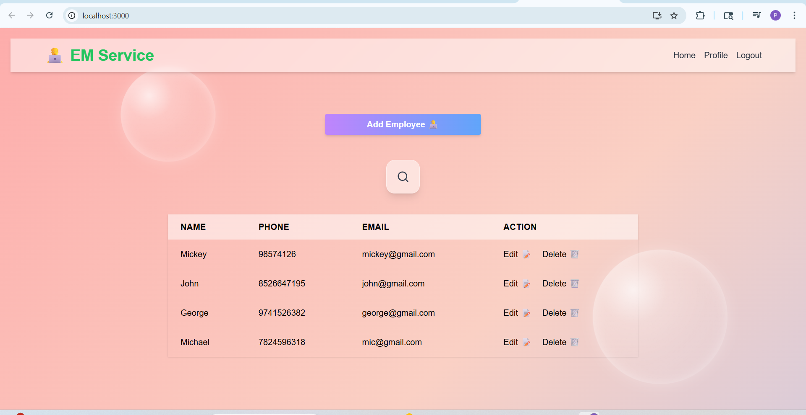
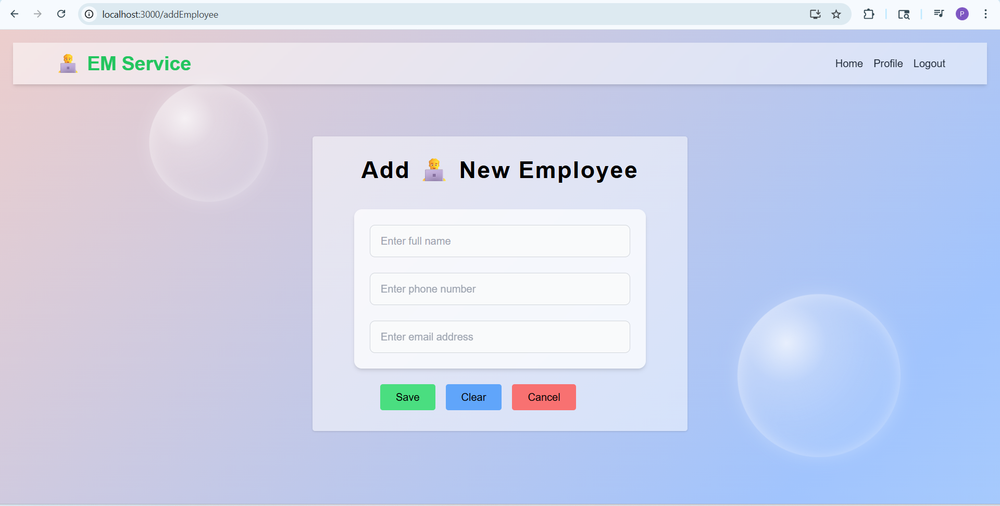
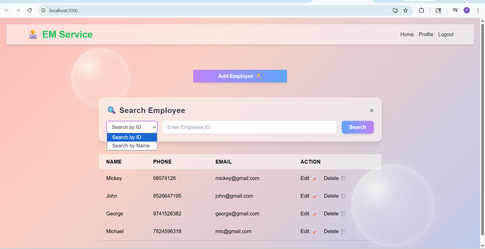
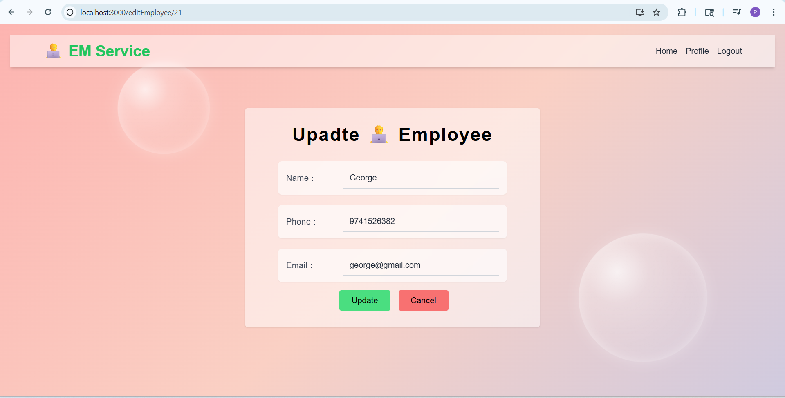

# Employee Management System

## Live Demo
Link : https://employee-management-system-delta-five.vercel.app/

## Project Overview

This is a full-stack web application to manage employee records.
Users can add, update, delete, and view employee details through a simple and responsive interface.

---

## Tech Stack

### Frontend

* React.js
* Tailwind CSS
* Axios

### Backend

* Spring Boot
* Java
* REST APIs

---

## Features

* Add new employees
* Update employee details
* Delete employees
* View employee list
* REST API integration between frontend and backend

---

## Project Structure

```
project-root/
 ├── backend/   (Spring Boot application)
 ├── frontend/  (React application)
```

---

## How to Run the Project

### 1. Clone the repository

```
git remote add origin https://github.com/Prerna-251/Employee-Management-System.git
cd employee-management-system
```

---

### 2. Run Backend (Spring Boot)

```
cd backend
mvn spring-boot:run
```

Backend will start at:

```
http://localhost:8080
```

---

### 3. Run Frontend (React)

```
cd frontend
npm install
npm start
```

Frontend will start at:

```
http://localhost:3000
```

---

## API Endpoints (Example)

* GET /employees → Get all employees
* POST /employees → Add employee
* PUT /employees/{id} → Update employee
* DELETE /employees/{id} → Delete employee

---

## Screenshots

### Home Page


### Add Employee


### Search Employee


### Update Employee


---

